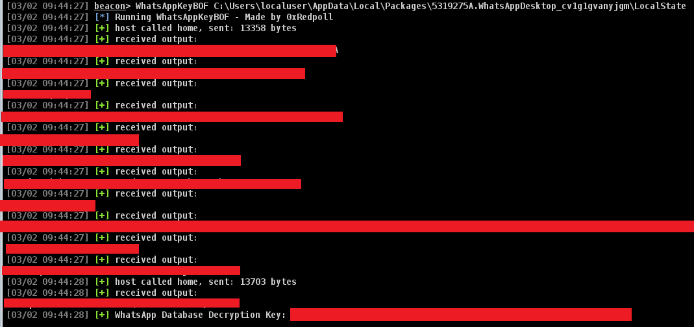

# WhatsAppKeyBOF

A Cobalt Strike BOF and DB decrypter script to retrieve the WhatsApp DB decryption key for WhatsApp Desktop via beacon.

> [!WARNING]
> Only works on Windows hosts with WhatsApp Desktop installed.

## Requirements
- A Cobalt Strike beacon on a compromised host
- python3 on PATH

## Build Info

  ```make all```

## Usage
  WhatsAppKeyBOF <Path to WhatsAppDesktop LocalState directory. See example below for typical location>



You will then need to exfiltrate the messages.db, messages.db-wal files from the compromised host and run the whatsapp_db_exporter.py to decrypt the DB with the returned key.

## References
- Kraftdenker's [ZAPiXDESK Tool](https://github.com/kraftdenker/ZAPiXDESK/tree/main), which inspired this tool and process.

## License

[//]: # (If you change the License type, be sure to change the actual LICENSE file as well)
GPLv3

## TODO
- This tool does not extract information from the DB owing to this BOF already taking far longer than expected. Feel free to contribute a tool to extract, however you can open the decrypted DB with a DB viewer.

## Author Information

This tool was created by [0xRedpoll](https://github.com/0xRedpoll).